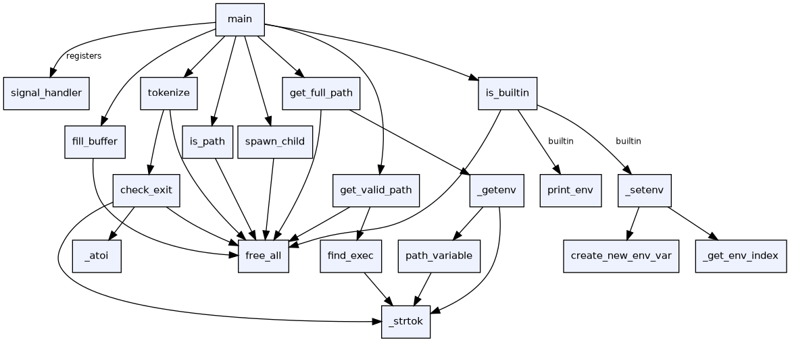

# The _printf() function

## Contents
```
.
├── _atoi.c
├── _getenv.c
├── _setenv.c
├── _strtok.c
├── AUTHORS
├── fill_buffer.c
├── find_exec.c
├── free_all.c
├── get_full_path.c
├── get_valid_path.c
├── hsh
├── is_builtin.c
├── is_path.c
├── main.h
├── man_simple_shell
├── print_env.c
├── README.md
├── shell
├── signal_handler.c
├── simple_shell.c
├── spawn_child.c
└── tokenize.c
```
## Project Function Tree
```
main()  [simple_shell.c]
│
├── signal(SIGINT, signal_handler)  ──► signal_handler()  [signal_handler.c]
│                                         └── printf / fflush  (libc)
│
└── while (1)  ─────────────────────────────────────────────────────────────
    │
    ├── fill_buffer()  [fill_buffer.c]
    │   ├── free_all()  [free_all.c]
    │   └── exit()  (on EOF)
    │
    ├── tokenize(buffer, av)  [tokenize.c]
    │   ├── free_all()
    │   ├── _strtok()  [_strtok.c]
    │   ├── check_exit()  [tokenize.c — static helper, not in main.h]
    │   │   ├── _strtok()
    │   │   ├── _atoi()  [_atoi.c]
    │   │   ├── free_all()
    │   │   └── exit()
    │   └── _strtok()  (loop for remaining tokens)
    │
    ├── [absolute/relative path branch: '/' in argv[0]]
    │   └── is_path()  [is_path.c]
    │       └── free_all()  (on error)
    │
    └── [PATH lookup branch: no '/' in argv[0]]
        │
        ├── is_builtin()  [is_builtin.c]
        │   ├── print_env()  [print_env.c]          ← "env"
        │   ├── _setenv()  [_setenv.c]              ← "setenv"
        │   │   ├── _get_env_index()  [_setenv.c — local]
        │   │   │   └── strtok()  (stdlib, not _strtok)
        │   │   └── create_new_env_var()  [_setenv.c — local]
        │   └── free_all()
        │
        ├── get_full_path()  [get_full_path.c]
        │   ├── _getenv("PATH")  [_getenv.c]
        │   │   ├── _strtok(var, "=")
        │   │   └── path_variable()  [_getenv.c — local]
        │   │       └── _strtok(NULL, "=")
        │   └── free_all()  (on error)
        │
        ├── get_valid_path()  [get_valid_path.c]
        │   ├── find_exec()  [find_exec.c]
        │   │   └── _strtok(full_path, ":")  (loop)
        │   └── free_all()  (on error)
        │
        └── spawn_child()  [spawn_child.c]
            └── free_all()
```
## Function Call Graph



## Compile
```
gcc -Wall -Werror -Wextra -pedantic -Wno-format -std=gnu89 *c
```

## Description
This repo contains a simple shell that covers all executables located in /bin as well the the builtin commands listed below in the builtins header. We were also able handle crtl C signal and one input of crtl D.The simple shell was created in a group of 2 over the course of 2 weeks as our final project for C.

## Builtins Available
Available via our shell are the following builtin commands:
- env
- setenv

## Global Variables
We chose to use 3 global variables within our simple_shell to help reduce the amount of times we were having to pass them as parameters through the program. 
### argc
argc is an int used to count the amount of arguments inputted into getline(). It is used by custom builtin functions (setenv) to check that the correct amount of arguments have been passed (NAME VALUE) and to print custom error messages.
### environ_is_heap
environ_is_heap is an int that is set to 1 on the creation of a new environment which has been dynamically allocated. This is then referenced when we are exiting the program, signalling us to free the environment before exiting.
### error_code
error code is an int that is used to store the previous child's error code which is used when exiting the simple_shell. It may also be updated by functions to reflect an error before the child process has been created.


## Limitations
### CRTL D
We were told to handle control D in the list of tasks we were given and set off to test and understand how it works on our local machines shells. Nick tested it via Unbuntu and Jeff via ZShell. Both showcased different functionality but the same core principle - if there is text in the command line, no amount of pressing CRTL D will cause your shell to logout. We were unfortunately unable to replicate this behaviour as CRTL D is not a signal that we are able to intercept. What our shell does handle with CRTL D is that on a single input it will do nothing to the current command line. We have been told that this is the maximum functionality the teaching staff expected from "handling control D" and were unable to reason why 2 consecutive CRTL D's would cause a exit of the shell.

### command line history
One function that we really wanted to implement was a history of commands that were previously input, a similar behaviour to how the 'up' and 'down' arrows act in a common shell. This desire was purely out of annoyance when we were trying to test a command multiple times in our simple shell but were being met with $^[[A^. We may still look into adding this functionality at a later date but the due date draws near. Our thought process currently is to create a listed list storing the previous commands in which we would be able to navigate through.

### setenv override
Our final simple_shell has a constant memory leak which relates to setenv. When overwriting an environment variable for the first time, we lose the pointer to the previously assigned variable, which is showcased in the still reachable: section of the below valgrind report.
This mimics how glibc functions work as you are not able to definitely tell if an environment variable has been allocated on the heap or is on the stack. We felt that fixing this error was outside of the scope for a simple shell. When you overwrite a second time, the still reachable becomes definitely lost.

```
==11793== HEAP SUMMARY:
==11793==     in use at exit: 10 bytes in 1 blocks
==11793==   total heap usage: 10 allocs, 9 frees, 2,502 bytes allocated
==11793== 
==11793== LEAK SUMMARY:
==11793==    definitely lost: 0 bytes in 0 blocks
==11793==    indirectly lost: 0 bytes in 0 blocks
==11793==      possibly lost: 0 bytes in 0 blocks
==11793==    still reachable: 10 bytes in 1 blocks
==11793==         suppressed: 0 bytes in 0 blocks
```

An aternative to fix this would be to create a data structure to hold the previously allocated variables which on exit will free them.

### Appeasement of the checker
We found that when creating the simple shell and given a set of specific hoops to jump through the quality of our code started to become inflexible. The program became more and more able specific cases being solved instead of simple good functions. In future we should either focus more on how to make our functions more robust given the hoops, or check later on in our progress.


## Takeaways
We both found this project quite eye opening in how we have learnt C and coding in general. As we have constantly been doing small tasks that rarely hit the ol Betty requirement of 40 lines per function, we were 1 week in this only a main - "we'll refactor later when its working" we told ourselves. What this resulted in is a huge lack of scalability within our code. At one point a integer was passed from the start of main into the very last function along with 6 other parameters. If we were to begin this project again, we would start prototyping deeper from the start and create a robust plan on how our functions will interact.

It has been enjoyable to look deeper into commands and builtin functions that we have taken for granted over our pass 3 months. We both feel we have gained a deeper understanding and appreciation for how the much a shell does for programmers.

One of the biggest flaws we believe is in our current code is the names of our scripts and functions. So quickly after refactoring were we scanning every single script to find one function we wanted to change. Moving forward we will take more time when naming functions/scripts.

## Authors

Nick Bath and Jeffrey Mori Ubaldini